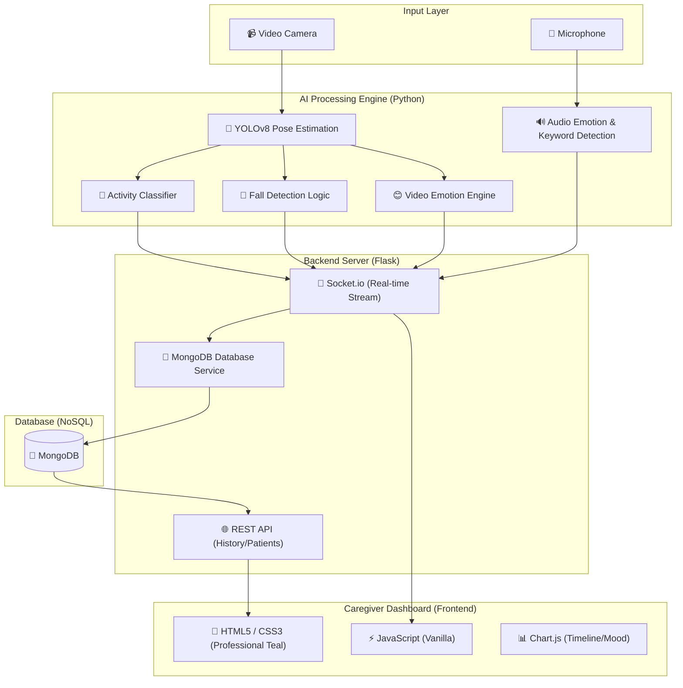

# 🏥 Elderly Care AI Monitoring System (Pro Dashboard)

A robust, full-stack AI monitoring system designed for elderly care. This system performs real-time activity detection, fall detection, and emotion recognition using deep learning, with persistent data storage in MongoDB and a professional web-based dashboard for caregivers.

---

## 🏗️ System Architecture

The following diagram illustrates the high-level architecture of the system:



---

## 🔄 Project Operational Flow

1.  **Ingestion**: 
    *   **Video**: The system captures real-time video frames.
    *   **Audio**: The system captures ambient audio via the microphone.
2.  **Detection**:
    *   **YOLOv8** extracts human pose skeletons (keypoints).
    *   **Activity Classifier** detects if the person is Sitting, Standing, Walking, or Lying Down.
    *   **Fall Detector** monitors for rapid impacts or position changes.
    *   **Video Emotion Engine** analyzes facial expressions.
    *   **Audio Processor** detects emotional tones in voice (e.g., distress, anger) and listens for specific keywords like "Help!", "Fall!", or "Pain!".
3.  **Real-time Streaming**:
    *   Annotated video and audio status updates are emitted via **WebSockets (Socket.io)** for zero-latency dashboard updates.
4.  **Persistence**:
    *   The **Database Service** asynchronously batches and stores all multi-modal data (Activity, Emotion, Audio alerts) into **MongoDB**.
5.  **Analytics & Management**:
    *   The Dashboard fetches historical data from MongoDB to populate **Events History** and **Patient Information** tables.
    *   **Chart.js** visualizes trends in movement and mood over time.

---

## 🚀 Key Features

*   **Professional Dashboard**: A premium, teal-themed UI built for medical environments.
*   **MongoDB Integration**: Persistent storage for long-term health monitoring.
*   **Real-time HUD**: High-Performance Video Overlay showing counts, active alerts, and current status.
*   **Patient Management**: Tabular display of patient info, room numbers, and emergency contacts.
*   **Multi-Modal AI**: Combines YOLOv8 (Pose), Video Emotion recognition, and Audio Analysis for holistic monitoring.
*   **Responsive Alerts**: Auto-generated alerts for falls, extended inactivity, or emotional distress.

---

## 📁 Project Structure

```text
Major/
├── backend/
│   ├── dashboard/
│   │   └── app.py              # Main Flask + WebSocket Server
│   ├── src/
│   │   ├── database.py         # MongoDB Service & Dataclasses
│   │   ├── detector.py         # Pose Estimation Logic
│   │   └── elderly_care_monitor.py # Aggregate Monitoring Engine
│   └── run_dashboard.py        # Entry point to launch backend
├── frontend/
│   ├── templates/
│   │   └── index.html          # Professional Dashboard Layout
│   └── static/
│       ├── css/style.css       # Premium Teal Design System
│       └── js/dashboard.js     # Real-time UI & MongoDB Integration
├── requirements.txt            # System dependencies
└── README.md                   # This file
```

---

## 🛠️ Configuration & Setup

### 1. Prerequisites
*   Python 3.8+
*   MongoDB (Local or Atlas)
*   Camera (Integrated or External)

### 2. Environment Setup
```bash
# Install dependencies
pip install -r requirements.txt

# Configure MongoDB (Optional)
# Set MONGO_URI in .env if using a remote cluster
# Default: mongodb://localhost:27017/
```

### 3. Running the System
```bash
# Navigate to backend directory
cd Major/backend

# Launch the Dashboard
python run_dashboard.py
```
Open your browser at `http://localhost:5000/dashboard`

---

## 📊 Feature Breakdown

| Feature | Technology | Description |
| :--- | :--- | :--- |
| **Video Processing** | OpenCV | Frame capture and annotation |
| **Skeleton Detection** | YOLOv8-Pose | Real-time human keypoint extraction |
| **Web Infrastructure** | Flask | Multi-threaded Python web server |
| **Live Communication** | Socket.io | Bi-directional real-time data flow |
| **Data Persistence** | MongoDB | NoSQL storage for high-frequency logs |
| **Visualization** | Chart.js | Dynamic mood and activity timelines |

---

## 👩‍⚕️ Caregiver Dashboard Controls

*   **Start/Stop Monitoring**: Control the AI camera engine.
*   **Patient Refresh**: Sync patient information from MongoDB.
*   **Alert Clear**: Acknowledge and clear current notification queue.
*   **Timeline Filters**: View activity and emotion stats for different time periods.


